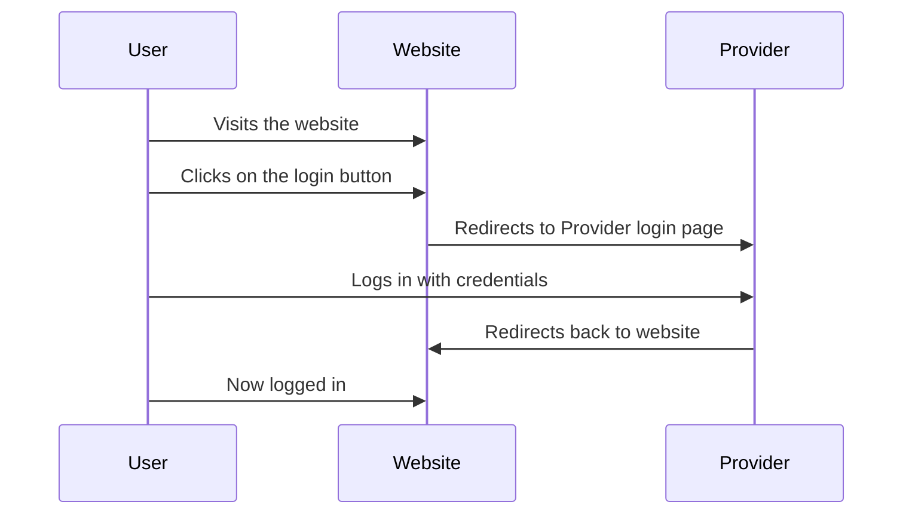

# Authentication Implementation 🏗️🚧

## Authentication

### Authentication Flow

The authentication flow is as follows:

1. User visits the website
2. User clicks on the login button
3. User is redirected to (Provider Login Page) sach as facebook, google, github, etc.
4. User logs in with their credentials
5. User is redirected back to the website
6. User is now logged in


### Authentication Flow Diagram




### Authentication Flow Code

The code for the authentication flow is as follows:

> pages/index.vue
    
```html
<template>
    <div>
        <h1>Home</h1>
        <button @click="login">Login</button>
    </div>
</template>

<script setup lang="ts">

</script>
```


