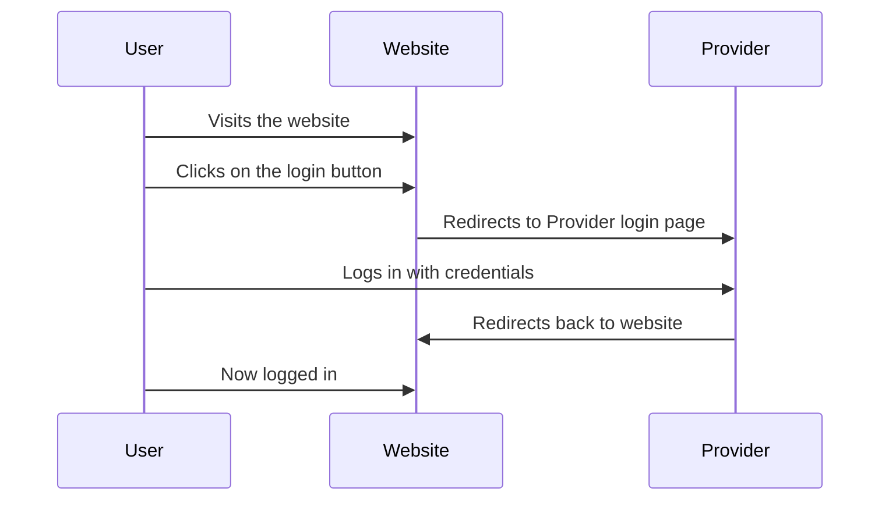
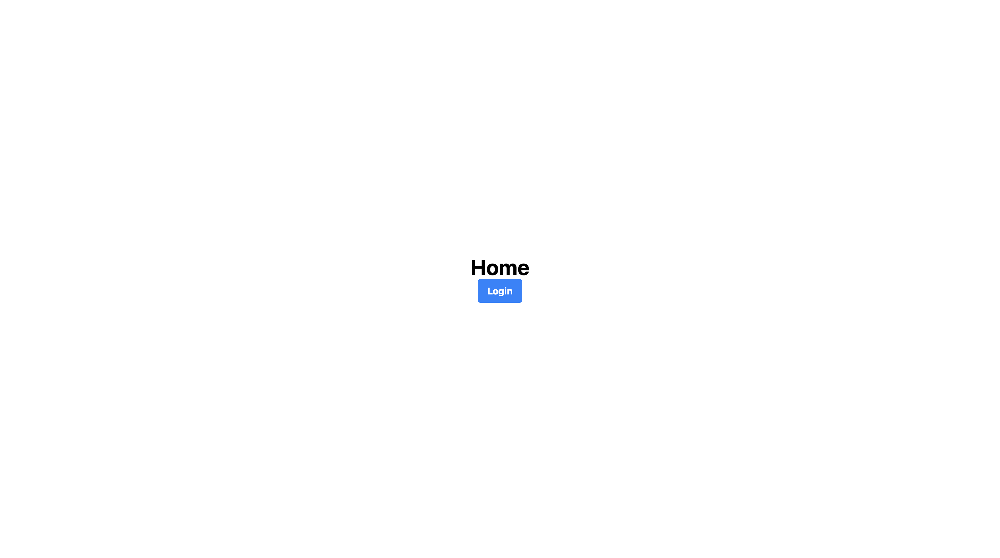

# Authentication Implementation 🏗️🚧

## Authentication

### Authentication Flow

The authentication flow is as follows:

1. User visits the website
2. User clicks on the login button
3. User is redirected to (Provider Login Page) sach as facebook, google, github, etc.
4. User logs in with their credentials
5. User is redirected back to the website
6. User is now logged in


### Authentication Flow Diagram




### Authentication Flow Code

The code for the authentication flow is as follows:

- create pages/index.vue by useing `CLI`
```bash
$ npx nuxi add page index
```

more info for `CLI` [here](https://nuxt.com/docs/api/commands/add#nuxi-add-page)


- make sure your remove App.vue if exists from root directory
  
> pages/index.vue
    
```html
<template>
    <div>
        <h1>Home</h1>
        <button @click="login">Login</button>
    </div>
</template>

<script lang="ts" setup>

</script>
```


- add css to pages/index.vue use [tailwindcss](https://tailwindcss.com)
  
> pages/index.vue

```html
<template>
    <div class="flex flex-col items-center justify-center h-screen">
        <h1 class="text-4xl font-bold">Home</h1>
        <button @click="login" class="bg-blue-500 hover:bg-blue-700 text-white font-bold py-2 px-4 rounded">Login</button>
    </div>
</template>

<script lang="ts" setup>
</script>

```

and will be like this after add some css to it.



- add login function to pages/index.vue

    - 😷 The strategy is to redirect the user to the provider login page, and then redirect them back to the website after they have logged in.
    and send token or code to backend to get user info.

    - 👽 But before that we need to create [State Management](https://nuxt.com/docs/getting-started/state-management) , for user info and token.
    
    - ☠️ [Middleware](https://nuxt.com/docs/guide/directory-structure/middleware) function to check if user is logged in or not.

    After add state management we will have this structure

    ```bash
    .
    ├── pages
    │   ├── index.vue
    │   └── dashboard/
    │       └── index.vue //auth protected page
    ├── composables
    │   └── user.ts
    ├── middleware
    │   └── auth.ts
    ├── nuxt.config.ts
    └── package.json
    ```

**Note: create dashboard page by useing `CLI`**

```bash
$ npx nuxi add page dashboard/index
```

** Note: create middleware by useing `CLI`**

```bash
$ npx nuxi add middleware auth
```

** Note: create composables by useing `CLI`**

```bash
$ npx nuxi add composable user
```


## State Management

- create composables/user.ts
  
> composables/user.ts

```ts
export const useUser = () => {
    const user = ref(null)
    const token = ref(null)

    return {
        user,
        token
    }
}
```
we will use this to check if user is logged in or not and get user info and token.

- add user and token to pages/index.vue

> pages/index.vue

<!-- ```html
<template>
    <div class="flex flex-col items-center justify-center h-screen">
        <h1 class="text-4xl font-bold">Home</h1>
        <button @click="login" class="bg-blue-500 hover:bg-blue-700 text-white font-bold py-2 px-4 rounded">Login</button>
    </div>
</template>

<script lang="ts" setup>

</script>

``` -->

- add middleware auth to dashboard/index.vue

> pages/dashboard/index.vue

```html
<template>
    <div class="flex flex-col items-center justify-center h-screen">
        <h1 class="text-4xl font-bold">Dashboard</h1>
    </div>
</template>

<script lang="ts" setup>
definePageMeta({
  middleware: 'auth'
})
</script>

```
This Page will be protected by middleware auth. and will be redirect to home page if user is not logged in.


## Middleware

- Middleware is a function that is run before rendering a page, either on the client-side or server-side.

- create middleware/auth.ts

> middleware/auth.ts

```ts
import { useUser } from "~~/composables/user"
export default defineNuxtRouteMiddleware((to, from) => {
    const { user } = useUser()
    if (!user.value) {
        return ("/")
    }
})
```
Our dashboard page will be protected by this middleware. and will be redirect to home page if user is not logged in.

