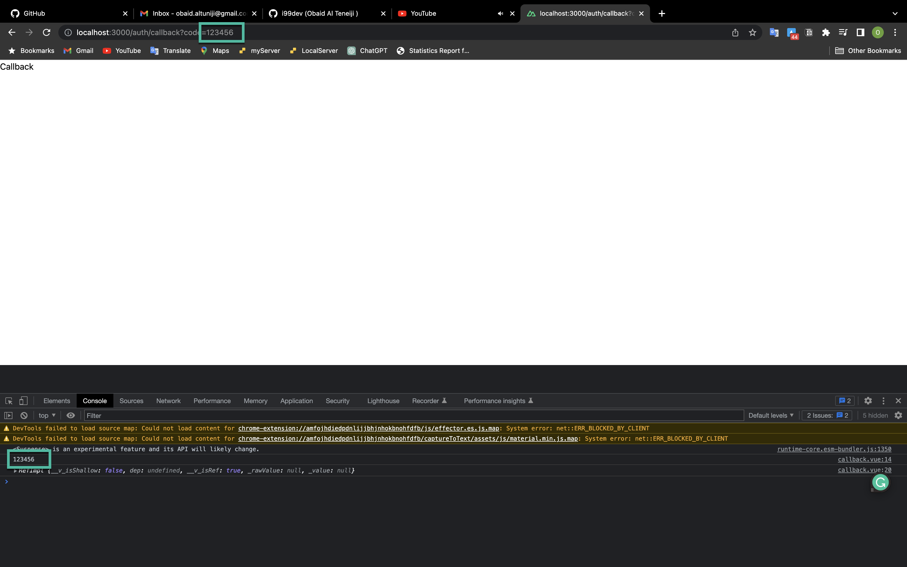
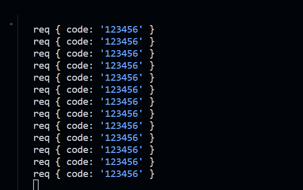

# provider Login 🚧 under construction 🚧

We will use Github as an example to implement the provider login.

## 1. ngrok setup

We will use ngrok to create a tunnel to our local server. and we can use the tunnel to test the provider login.

```bash
$ ngrok http 3000
```

## 2. Github setup

### 2.1. Github OAuth App

We need to create a Github OAuth App to get the `client_id` and `client_secret`.

### 2.2. Github OAuth App Callback URL

We need to set the callback URL to the ngrok tunnel URL.

## 3. Nuxt3 setup

### 3.1. Nuxt3 env

We need to set the `client_id` and `client_secret` in the `.env` file.

```bash
GITHUB_CLIENT_ID=xxxxxxxxxxxxxxxxxxxx
GITHUB_CLIENT_SECRET=xxxxxxxxxxxxxxxxxxxxxxxxxxxxxxxxxxxxxxxx
```
we will use this env with our MockApi to get the access token but on real you will add this step to your backend.

### 3.2. Nuxt3 MockApi

We need to create a MockApi to get the access token.

- crete new route file on @api folder `github.js`

```js
const express = require("express");
const router = express.Router();

router.post("/", async (req, res) => {
  const { code } = req.body;
  consel.log(code)
  res.send({ code });
});

module.exports = router;

```
more info about the Github OAuth App [here](https://docs.github.com/en/developers/apps/building-oauth-apps/authorizing-oauth-apps)

Don't forget to add the github route to the `index.js` file.

```js
const express = require("express");
const userRoutes = require("./user");
const githubRoutes = require("./github");

const app = express();
const port = 3010;
app.use("/user", userRoutes);
app.use("/github", githubRoutes);

app.listen(port, () => {
  console.log(`Example app listening at http://localhost:${port}`);
});
```


### 3.2. Nuxt3 Page

We need to create a page to handle the provider login callback.

```bash
$ npx nuxt add page "auth/callback.vue"
```

```html
<template>
  <div>
    <h1>Callback</h1>
  </div>
</template>

<script lang="ts" setup>
import { useRouter } from 'vue-router'

const router = useRouter()
const { code } = router.currentRoute.value.query

if (code) {
  const { data,pending, error, refresh } = await useFetch("http://localhost:3010/github",{
    method: "POST",
    body: JSON.stringify({ code }),
  });
  if (data) {
    console.log(data)
  }
</script>
```

when user press the provider login button, the Github OAuth App will redirect to the callback URL. and we can get the `code` from the URL query.

When you try visit page and add after path query `?code=123456` you will get the access token.
 
 

 acutally The code will get when the user press the provider login button and redirect to the callback URL.

 but here for test and show you thats wee are do manually.

## 4. Nuxt3 env

- we need install the `@types/node` package to use the `process.env` in the `@nuxtjs/composition-api` package.

```bash
$ yarn add -D @types/node
```
- add to  `nuxt.config.ts` on your nuxt root folder.

```js
export default defineNuxtConfig({
  runtimeConfig: {
    public:{
      apiBaseUrl: process.env?.API_BASE_URL as string,
    }
  },
});

```
This will help us to get the `apiBaseUrl` env in the `useRuntimeConfig` function.

- set `.env` file.

```bash
API_BASE_URL=http://localhost:3010
```
- update the `useFetch` function to use the `process.env.API_BASE_URL` env on `pages/auth/callback.vue` file.

```html
<script lang="ts" setup>
const router = useRouter()
const { code } = router.currentRoute.value.query
if (code) {
  const { data,pending, error, refresh } = await useFetch("github",{
    method: "POST",
    body: {
      code: code,
    },
    baseURL:useRuntimeConfig().apiBaseUrl,
  });
  console.log("data", data)
}
</script>
```

if  you try to visit the callback page  You will see on Your terminal the code. come on server side.



## 5. Nuxt3 MockApi

- update the `github.js` file to get the access token.

```js
const express = require("express");
const router = express.Router();
const axios = require("axios");

router.post("/", async (req, res) => {
  const { code } = req.body;
  const { data } = await axios.post(
    "https://github.com/login/oauth/access_token",
    {
      client_id: process.env.GITHUB_CLIENT_ID,
      client_secret: process.env.GITHUB_CLIENT_SECRET,
      code,
    },
    {
      headers: {
        accept: "application/json",
      },
    }
  );
  res.send(data);
});

module.exports = router;

```

- update `user.js` file to get the user data.

```js
const express = require("express");
const router = express.Router();
const axios = require("axios");

// add this route to get the user data
router.get("/github", async (req, res) => {
  const { authorization } = req.headers;
  const { data } = await axios.get("https://api.github.com/user", {
    headers: {
      Authorization: authorization,
    },
  });
  res.send(data);
});

module.exports = router;

```


## 6. Nuxt3 Page

- update the `pages/auth/callback.vue` file to get the user data.

```html
<script lang="ts" setup>
const router = useRouter()
const { code } = router.currentRoute.value.query
if (code) {
  const { data,pending, error, refresh } = await useFetch("user/github",{
    method: "POST",
    body: {
      code: code,
    },
    baseURL:useRuntimeConfig().apiBaseUrl,
  });
  if (data) {
    const { data: userData } = await useFetch("user", {
      headers: {
        Authorization: `Bearer ${data.access_token}`,
      },
    });
    console.log("userData", userData)
  }
}
</script>
```


- update the `pages/index.vue`  Button to redirect to the callback page.

```html
<template>
  <div>
    <h1>Home</h1>
    <button @click="login">Login</button>
  </div>

</template>

<script lang="ts" setup>
const login = () => {
   window.location.href = `https://github.com/login/oauth/authorize?client_id=${env.GITHUB_CLIENT_ID}&redirect_uri=${env.GITHUB_redirect_url}&scope=read:user`;
}
</script>
```

now you can try to login with the provider and get the user data.

# 7. State Management

Next will save the user data in the state management.

